# Polyticks — Full Application Flow Graphs & Architecture Specification (v4.0 + Fixes)

> **Generated:** 2026-08-30  
> **Source of Truth:** Flutter Codebase (`lib/`)  
> **Scope:** Full application routing, user roles (`Janta`, `Party Member`, `Party Official`, `Admin Moderator`), authentication, identity verification (DigiLocker/Manual), civic feed, reaction & fact-check engine, moderation SLA, party hierarchy, B2B subscriptions, Right-of-Reply portal, and analytics dashboard.

---

## 1. System Role Matrix & Capabilities

| Role | Verification State | Primary Capabilities & Gating |
| :--- | :--- | :--- |
| **Guest Janta** | Unverified (Synthetic) | Read public feeds/posts/polls; restricted from creating posts, voting on polls, reacting, or submitting fact checks. |
| **Unverified Janta** | Unverified / Pending | Directed to `IdVerificationScreen` on sign-in; read feeds, update basic profile; posting & voting restricted until verified. |
| **Verified Janta** | Verified (DigiLocker / Admin approved) | Full civic participation: post in Hyper-Local & Broader channels (280 chars), like/dislike all posts, vote in public polls, submit community notes (`SubmitFactCheckModal`), report content. |
| **Party Member** | Verified (Tier 1–9) | All Janta capabilities + auto-follow own party, post in party channels, vote in party-exclusive polls, hold hierarchy tier (`PartyRole` tiers 1–9). Higher tiers can assign/revoke subordinate member roles. |
| **Party Official** | Verified (Org Account) | Manage party profile, create official party posts & ballot polls, assign top-tier roles (1-5), access `OrgSubscriptionScreen` (Razorpay Gold/Platinum), publish official statements via `RightOfReplyPortal`, view `AnalyticsDashboard`. Cannot react to own org posts. |
| **Admin Moderator**| Verified System Admin | Routes directly to `AdminConsoleScreen`; manage ID verification queue (with zero-retention document auto-purge & audit logs), review content moderation SLA queue (`AdminModerationQueueScreen`), resolve flagged/auto-hidden posts. |

---

## 2. App Entry Point & Conditional Navigation Flow Graph

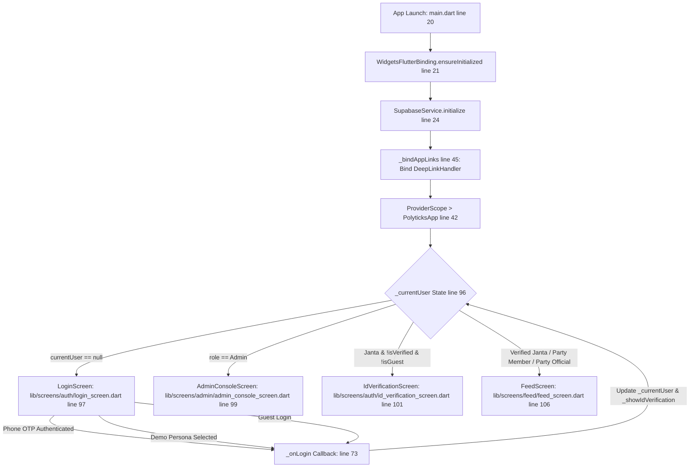

- **File Reference:** `lib/main.dart`
  - `main()`: lines 20–44
  - `_bindAppLinks()`: lines 45–60
  - `_PolyticksAppState.build()`: lines 94–118

---

## 3. Authentication & Identity Verification Flows

### 3.1 Authentication & Persona Simulation Flow Graph

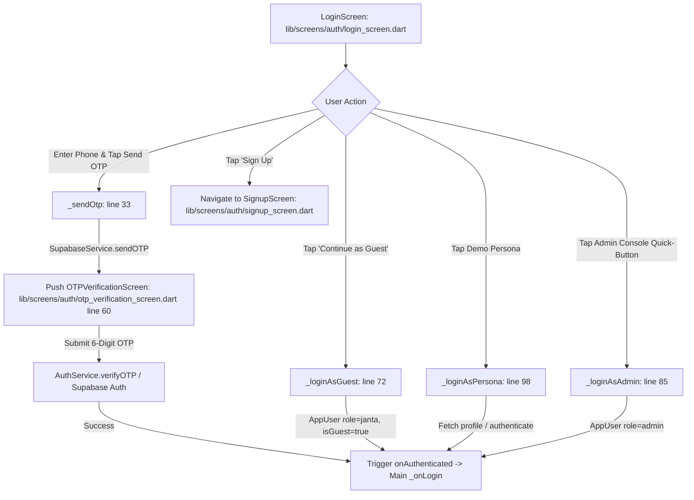

- **File References:**
  - `lib/screens/auth/login_screen.dart`: `_sendOtp`, `_loginAsGuest`, `_loginAsAdmin`, `_loginAsPersona`
  - `lib/screens/auth/signup_screen.dart`
  - `lib/screens/auth/otp_verification_screen.dart`
  - `lib/services/auth_service.dart`

---

### 3.2 Government ID & DigiLocker eKYC Flow Graph

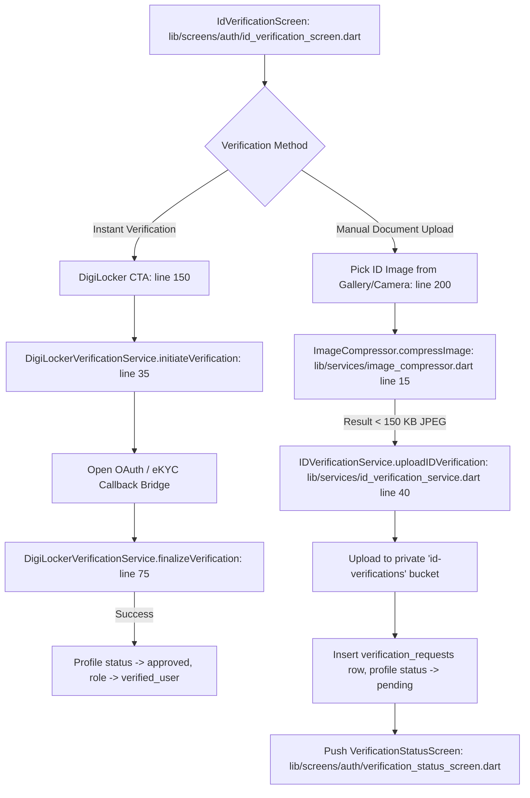

- **File References:**
  - `lib/screens/auth/id_verification_screen.dart`
  - `lib/screens/auth/verification_status_screen.dart`
  - `lib/services/digilocker_verification_service.dart`
  - `lib/services/id_verification_service.dart`

---

## 4. Civic Feed & Interaction Engine Flows

### 4.1 Dual Feed & Channel Filtering Flow Graph

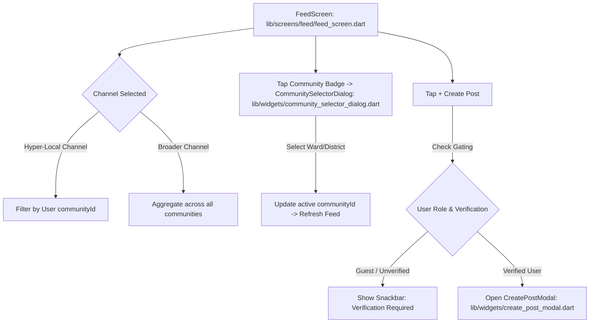

- **File References:**
  - `lib/screens/feed/feed_screen.dart`
  - `lib/widgets/community_selector_dialog.dart`
  - `lib/widgets/create_post_modal.dart`

---

### 4.2 Post Creation & AI Safety Screening Flow Graph

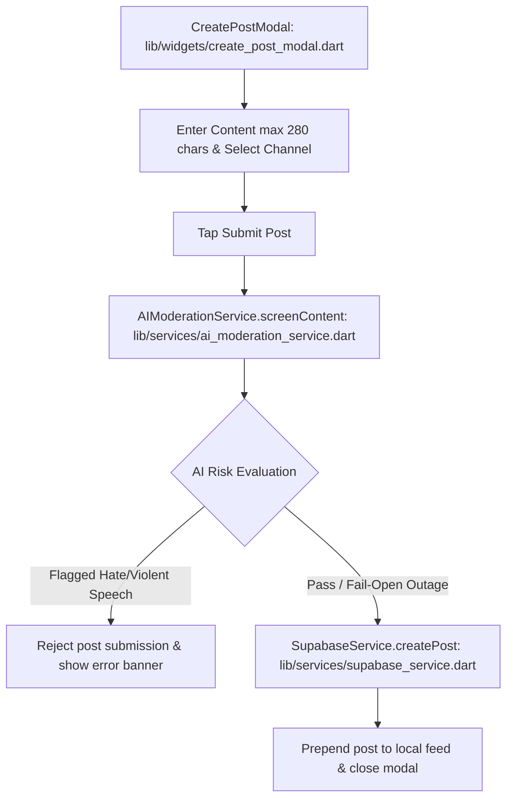

- **File References:**
  - `lib/widgets/create_post_modal.dart`
  - `lib/services/ai_moderation_service.dart`
  - `lib/services/supabase_service.dart`

---

### 4.3 Optimistic Reaction Engine & Dislike Trigger Flow Graph

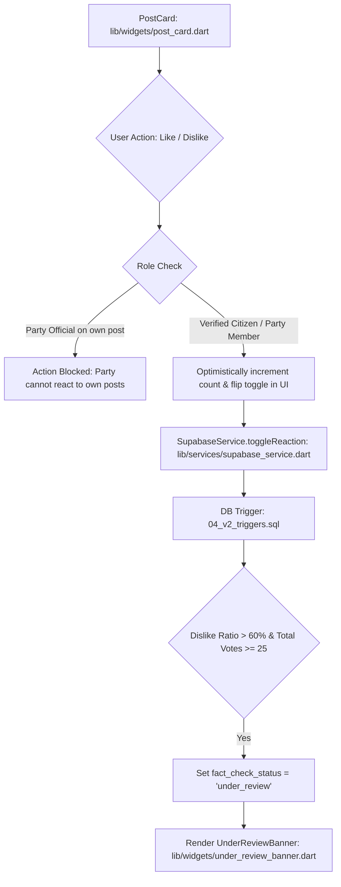

- **File References:**
  - `lib/widgets/post_card.dart`
  - `lib/widgets/under_review_banner.dart`

---

### 4.4 Crowd Fact-Checking & Community Notes Flow Graph

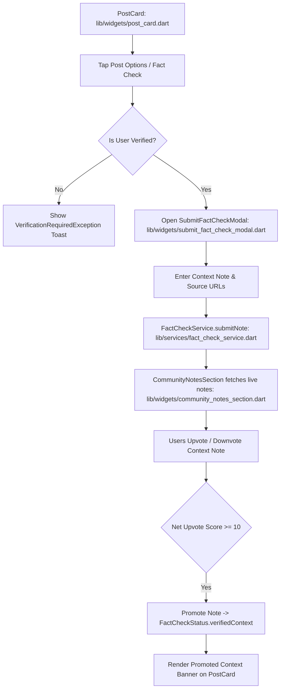

- **File References:**
  - `lib/widgets/submit_fact_check_modal.dart`
  - `lib/widgets/community_notes_section.dart`
  - `lib/services/fact_check_service.dart`

---

### 4.5 Content Reporting & 24h SLA Auto-Hide Flow Graph

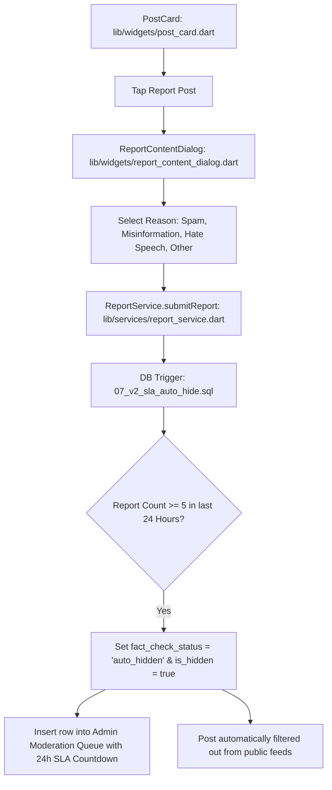

- **File References:**
  - `lib/widgets/report_content_dialog.dart`
  - `lib/services/report_service.dart`
  - `lib/screens/admin/admin_moderation_queue_screen.dart`

---

## 5. Party Profiles & Hierarchy Management

### 5.1 Party Hierarchy (`PartyRole` Tiers 1-9)
The application establishes a strict 9-tier hierarchy defined in `lib/models/models.dart`:
- **Tier 1:** President
- **Tier 2:** Vice President
- **Tier 3:** Executive Committee
- **Tier 4:** General Secretary
- **Tier 5:** Treasurer
- **Tier 6:** State President
- **Tier 7:** District President
- **Tier 8:** Mandal Level Officer
- **Tier 9:** Ground Worker

**Top-Tier Constraint:** Tiers 1–5 can ONLY be assigned by the verified `Party Official` account. Subordinate tiers (6-9) can be assigned by members of a higher tier.

### 5.2 Party Profile Flow Graph
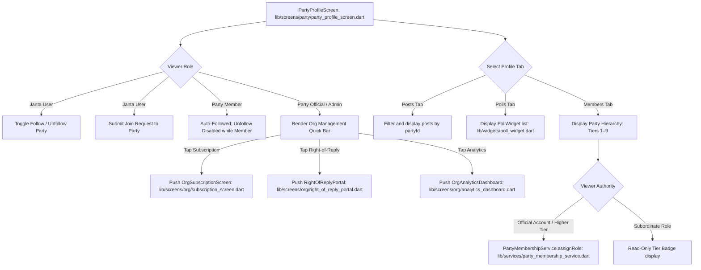

- **File References:**
  - `lib/screens/party/party_profile_screen.dart`
  - `lib/widgets/poll_widget.dart`
  - `lib/services/party_membership_service.dart`

---

## 6. Post Detail, Threaded Comments & Deep Linking Flows

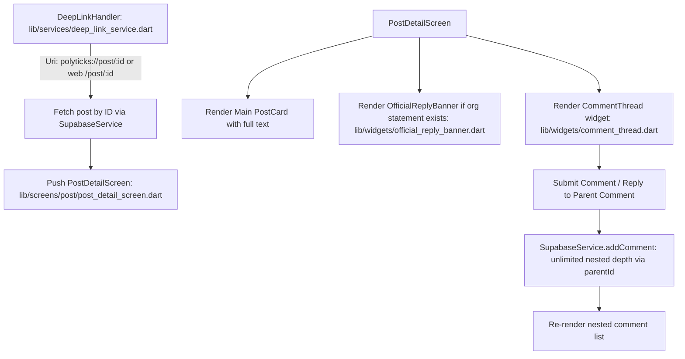

- **File References:**
  - `lib/screens/post/post_detail_screen.dart`
  - `lib/widgets/comment_thread.dart`
  - `lib/widgets/official_reply_banner.dart`
  - `lib/services/deep_link_service.dart`

---

## 7. Admin Governance & Moderation Console Flows

### 7.1 ID Verification Queue & Zero-Retention Auto-Purge Graph

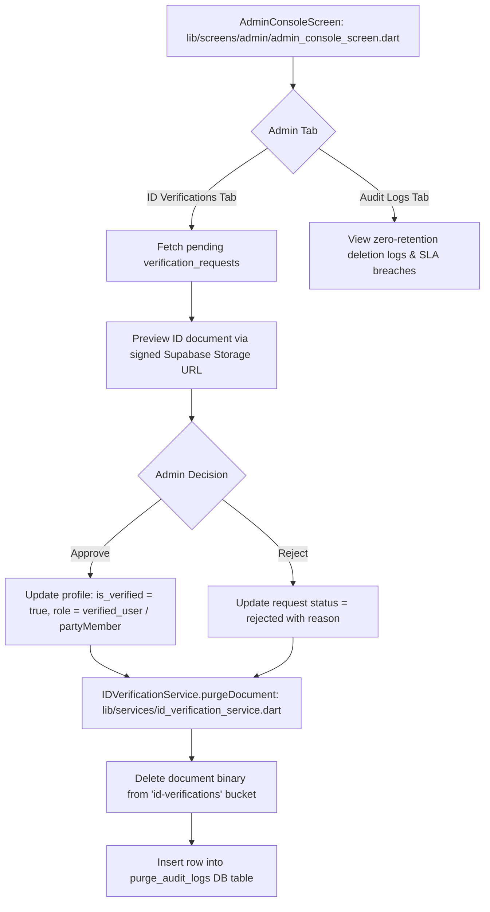

- **File References:**
  - `lib/screens/admin/admin_console_screen.dart`
  - `lib/services/id_verification_service.dart`
  - `lib/services/admin_moderation_service.dart`

---

### 7.2 Content Moderation SLA Queue Graph

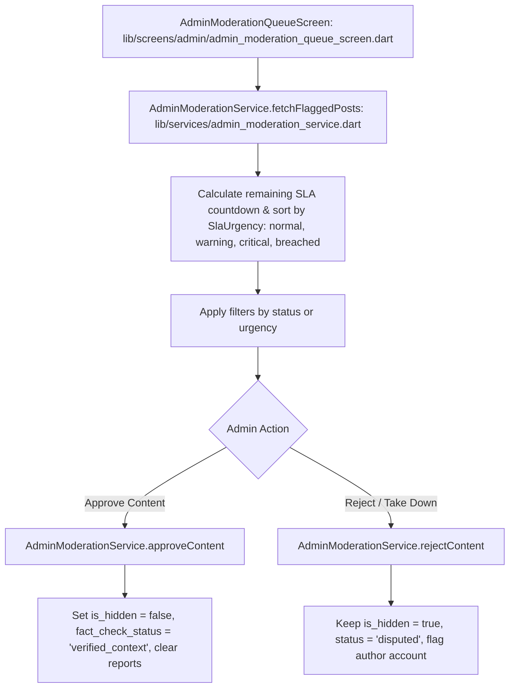

- **File References:**
  - `lib/screens/admin/admin_moderation_queue_screen.dart`
  - `lib/services/admin_moderation_service.dart`

---

## 8. Monetization, B2B Analytics & Right-of-Reply Flows (v4.0 Spec)

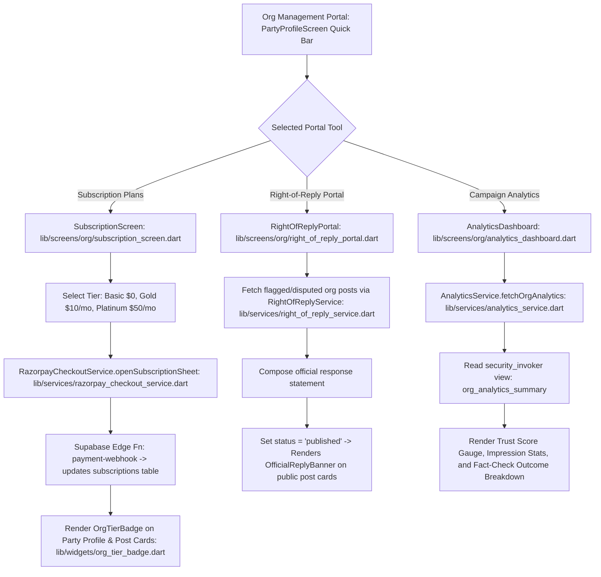

- **File References:**
  - `lib/screens/org/subscription_screen.dart`
  - `lib/screens/org/right_of_reply_portal.dart`
  - `lib/screens/org/analytics_dashboard.dart`
  - `lib/widgets/org_tier_badge.dart`
  - `lib/widgets/official_reply_banner.dart`
  - `lib/services/subscription_service.dart`
  - `lib/services/razorpay_checkout_service.dart`
  - `lib/services/right_of_reply_service.dart`
  - `lib/services/analytics_service.dart`

---

## 9. State Management & Riverpod Optimistic Data Flows

The application heavily utilizes Riverpod (`flutter_riverpod`) for managing asynchronous states and optimistic UI updates to ensure a highly responsive interface.

### 9.1 Poll Voting & Optimistic Update Flow
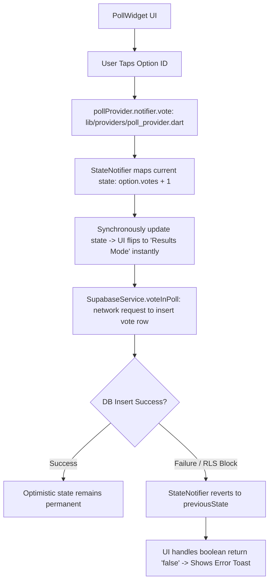

### 9.2 Content Moderation State Flow
```mermaid
graph TD
    Queue[AdminModerationQueueScreen] --> RefWatch[ref.watch(moderationNotifierProvider): lib/providers/moderation_provider.dart]
    RefWatch --> AsyncVal{AsyncValue State}
    
    AsyncVal -->|Loading| Spinner[Show ProgressIndicator]
    AsyncVal -->|Data| RenderQueue[Render ModerationState: filter, queue list, lastRefreshed]
    
    RenderQueue --> Action[Admin taps 'Approve / Reject']
    Action --> NotifierGuard[ModerationNotifier.resolveReport wraps logic in AsyncValue.guard]
    NotifierGuard --> AdminSvc[AdminModerationService DB update]
    AdminSvc --> RemapState[currentState.copyWith: filter out the resolved postId]
    RemapState --> RebuildUI[Screen rebuilds automatically without the resolved item]
```

- **File References:**
  - `lib/providers/poll_provider.dart`
  - `lib/providers/moderation_provider.dart`
  - `lib/providers/auth_provider.dart`

---

## 10. Codebase & Documentation Audit / Discrepancy Reconciliation

During this complete review of the v4.0 implementation codebase, the following documentation alignment points were verified:

1. **`docs/heart.md` (Line 8)**:
   - *Doc Statement:* Listed `lib/main.dart -> lib/screens/auth/login_screen.dart` as the sole entry point.
   - *Current Implementation:* `lib/main.dart` (lines 95–110) implements dynamic entry routing based on role and verification state (`LoginScreen`, `AdminConsoleScreen`, `IdVerificationScreen`, `FeedScreen`).
   - *Action:* Updated flowgraph in Section 2 accurately reflects this multi-branch routing logic.

2. **`docs/brain.md` (Line 5)**:
   - *Doc Statement:* Summarized state flow as `UI -> Riverpod Providers -> Services -> Supabase`.
   - *Current Implementation:* Core services (`SupabaseService`, `FactCheckService`, `SubscriptionService`, `AnalyticsService`) use Riverpod providers (`auth_provider.dart`, `fact_check_provider.dart`, `moderation_provider.dart`, `poll_provider.dart`) alongside direct singleton contracts for offline simulation mode (`AppConfig.forceTestMode`).
   - *Action:* Added Section 9 to explicitly graph how Riverpod `StateNotifier` operates for optimistic UI updates.

3. **`docs/V4_SPEC.md` & `ProjectTracker.md`**:
   - All v4.0 deliverables (DigiLocker mock bridge, Razorpay subscription checkout, B2B analytics rollups, Right-of-Reply portal, registration-lock trigger) are fully built in `lib/` and verified with 0 linter errors.
   - Future post-launch / v4.1 config items (such as live DigiLocker production credentials & live Razorpay keys) remain isolated in configuration flags (`lib/config.dart`).
